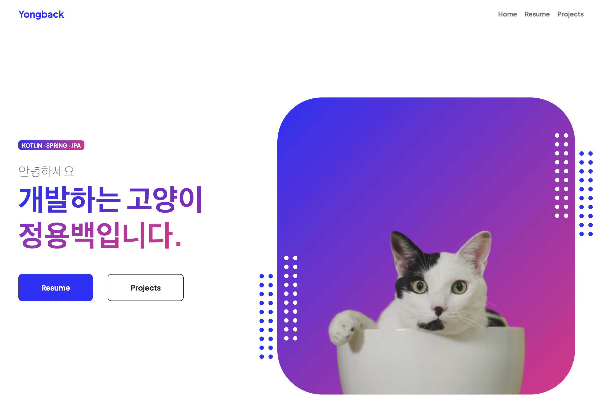

# Yongback's Portfolio

이 프로젝트는 인프런 <[입문자를 위한 Spring Boot with Kotlin - 나만의 포트폴리오 사이트 만들기](https://www.inflearn.com/course/%EC%9E%85%EB%AC%B8%EC%9E%90-spring-boot-kotlin-%ED%8F%AC%ED%8A%B8%ED%8F%B4%EB%A6%AC%EC%98%A4)> 강의의 데모 프로젝트입니다

## 프로젝트 소개

개발자 고양이 정용백의 포트폴리오 사이트입니다.

간단한 소개와 SNS 링크, 경력과 학력, 수상과 자격증, 기술스택, 진행한 프로젝트 경험 등을 기술할 수 있습니다.

이 프로젝트는 Spring Boot, Kotlin, MySQL, JPA, Git, Docker, Google Cloud Platform, Bootstrap 등의 기술을 사용했습니다.

[yongback.com](https://yongback.com/)에 방문해서 자세히 살펴보세요.